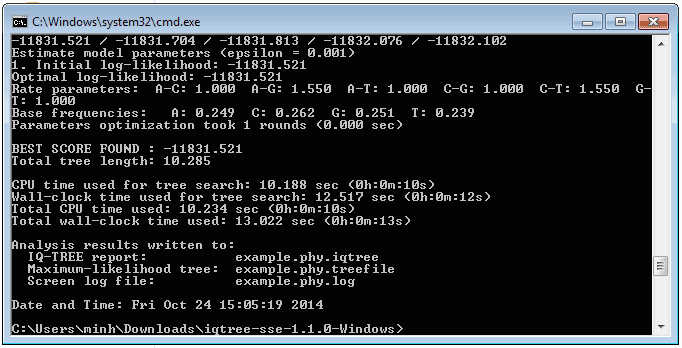
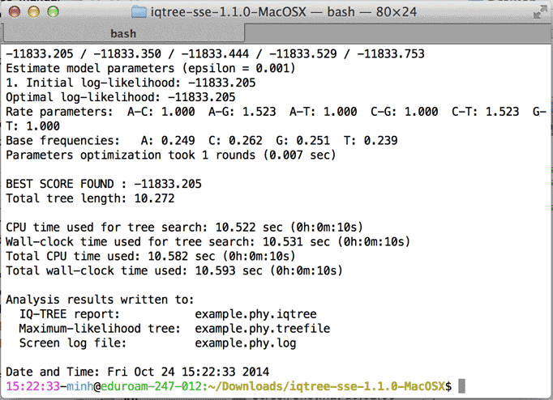

Recommended for users who just downloaded IQ-TREE the first time.
<!--more-->

<!-- START doctoc generated TOC please keep comment here to allow auto update -->
<!-- DON'T EDIT THIS SECTION, INSTEAD RE-RUN doctoc TO UPDATE -->
**Table of Contents**

- [Installation](#installation)
- [For Windows users](#for-windows-users)
- [For Mac OS X users](#for-mac-os-x-users)
- [Minimal command-line examples](#minimal-command-line-examples)

<!-- END doctoc generated TOC please keep comment here to allow auto update -->

Installation
------------

To achieve high performance IQ-TREE is a command-line program: you need to run IQ-TREE from a Terminal/Console (this is called Command Prompt under Windows). After you [downloaded IQ-TREE](../../#download), please:

* Extract the `.zip` (Windows, MacOSX) or `.tar.gz` (Linux) file to create a directory `iqtree-X.Y.Z-OS` or `iqtree-omp-X.Y.Z-OS`.
* You will find the executable in the `bin` sub-folder. Copy all files in `bin` folder to your system search path such that you can run IQ-TREE by entering `iqtree` or `iqtree-omp` from the Terminal.

Now you need to open a Terminal (or Console) to run IQ-TREE. See below the guide for [Windows users](#for-windows-users) and [Mac OS X users](#for-mac-os-x-users).

For Windows users
-----------------

Since IQ-TREE is a command-line program, clicking on `iqtree.exe` will not work. You have to open a Command Prompt for all analyses:

1. Click on "Start" menu (below left corner of Windows screen).
2. Type in "cmd" and press "Enter". It will open the Command Prompt window (see Figure below).
3. Go into IQ-TREE folder you just extracted by entering e.g.:

        cd Downloads\iqtree-1.3.10-Windows
        
    (assuming that IQ-TREE was downloaded into `Downloads` folder).
4. Now you can try an example run by entering:

        bin\iqtree -s example.phy
        
    (`example.phy` is the example PHYLIP alignment file also extracted in that folder).
5. After a few seconds, IQ-TREE finishes and you may see something like this:

    

Congratulations ;-) You have finished the first IQ-TREE analysis.

For Mac OS X users
------------------

1. Open the "Terminal", e.g., by clicking on the Spotlight icon (top-right corner), typing "terminal" and press "Enter".
2. Go into IQ-TREE folder by entering:

        cd Downloads/iqtree-1.2.0-MacOSX

    (assuming that IQ-TREE was downloaded into `Downloads` folder).
3. Now you can try an example run by entering 

        bin/iqtree -s example.phy

    (`example.phy` is the example PHYLIP alignment file also extracted in that folder).
4. After a few seconds, IQ-TREE finishes and you may see something like this:

    

Congratulations ;-) You have finished the first IQ-TREE analysis.

Minimal command-line examples
-----------------------------

A few typically analyses are listed in the following. Note that it is assumed that `iqtree` executable was already copied into system search path. If not, please replace `iqtree` with actual path to executable.

>**TIP**: Refer to [Beginner's tutorial](../Tutorial) for more details.

* Reconstruct maximum-likelihood tree from a sequence alignment (`example.phy`)
   with the best-fit substitution model automatically selected:

        iqtree -s example.phy -m TEST

* Reconstruct ML tree and assess branch supports with ultrafast bootstrap
   and SH-aLRT test (1000 replicates):

        iqtree -s example.phy -m TEST -alrt 1000 -bb 1000

* Perform partitioned analysis with partition definition file (`example.nex`)
   in Nexus or RAxML format using edge-linked model and gene-specific rates:

        iqtree -s example.phy -spp example.nex -m TEST

    (for edge-unlinked model replace `-spp` with `-sp` option)

* Merge partitions to reduce model complexity:

        iqtree -s example.phy -sp example.nex -m TESTMERGE

* Perform model selection only: use `-m TESTONLY` or `-m TESTMERGEONLY`

        iqtree -s example.phy -sp example.nex -m TESTMERGEONLY

* Use 4 CPU cores to speed up computation: use `iqtree-omp` and add `-nt 4` option, e.g.:

        iqtree-omp -s example.phy -m TEST -alrt 1000 -bb 1000 -nt 4

* Show all available options: 

        iqtree -h
        
