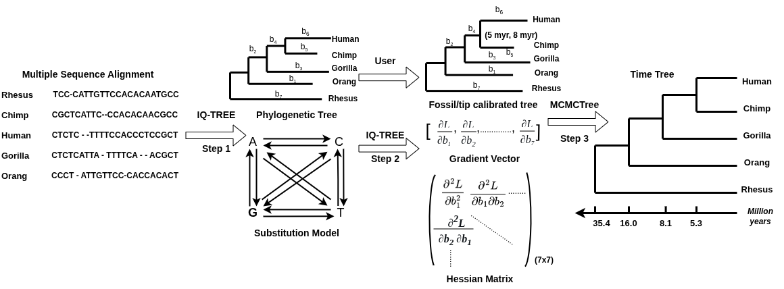

Phylogenetic Dating
===================

Bayesian dating with MCMCtree
------------------------------------------------------------

From IQ-TREE version 3.0.1 onwards, we provide the functionality in IQ-TREE to infer time trees
using Bayesian MCMCtree method.

If you use this feature, please cite:

> __P. Demotte, M. Panchaksaram, H. Kumarasinghe, N. Ly-Trong, M. dos Reis, and B.Q. Minh__
>(2025) IQ2MC: A New Framework to Infer Phylogenetic Time Trees Using IQ-TREE 3 and MCMCTree with Mixture Models. <https://doi.org/10.32942/X2CD2X>

IQ2MC workflow for time tree inference
--------------------------------------

The IQ2MC workflow has three steps that integrate IQ-TREE and MCMCtree. The
final output is a time-estimated phylogeny starting from a multiple-sequence
alignment as displayed in the following figure.

* `Step1`: Given an input multiple sequence alignment, IQ-TREE will infer the
maximum likelihood tree using the IQ-TREE tree search algorithm. Note that, the
tree estimated here should be a rooted tree or you need to manually root the
tree as MCMCtree only accepts rooted trees for phylogenetic dating. In this
step, IQ-TREE also estimates the best-fitted substitution model for the data if
you do not specify the model. This step is optional if you provide a rooted
tree, the MSA, and the substitution model for step 2.
* `step2`: For fast approximate likelihood dating, MCMC requires the gradients
and the Hessian/Hessians of the branch lengths calculated at maximum likelihood
estimates. Given the rooted tree with fossil/tip calibrations, the substitution
model, and the MSA, IQ-TREE generates the Hessian file containing the gradients
and the Hessian/Hessian and all required files to run MCMCtree for dating. If the 
rooted tree provided for this step does not include fossil/tip calibrations, users
need to calibrate the tree with commonly used tree editing tools such as FigTree
or iTOL before step 3.
* `step3`: Now, you can directly run MCMCtree from the IQ-TREE output of step 2
and infer the time tree. 



Estimating the gradients and the Hessian for MCMCtree dating
------------------------------------------------------------

To obtain the Hessian file for MCMCtree approximate likelihood dating, you need
to perform step 2 in the workflow. For this step, IQ-TREE expects a rooted tree
file, the substitution model, and the multiple sequence alignment. When
`--dating mcmctree` option is used as below, IQ-TREE performs the gradients and
the Hessian calculation and generates the `Hessian file`. This Hessian file is
compatible with MCMCtree and you can use it as an input to MCMCtree for
approximate likelihood dating. 

If the alignment file is called `example.phy` and the rooted tree file is called
`example_tree.nwk`,

```
iqtree3 -s example.phy -m GTR+G4 -te example_tree.nwk --dating mcmctree --prefix example
```


Note that, Here we generate the Hessian file for a fixed rooted tree. You can
directly input the rooted tree which already contains fossil/tip calibration
information added using tree editing tools such as FigTree. When using the above
command, IQ-TREE generates the following files which can be used to run MCMCtree
for phylogenetic dating.

* `example.mcmctree.hessian`:  the hessian file which contains the gradients
vector and the Hessian for approximate likelihood dating.
* `example.rooted.nwk` : the rooted tree file which is compatible with the
Hessian file. It is necessary to use this tree file with MCMCtree for dating as
the Hessian is calculated with respect to the ordering of taxa of this tree
file.
* `example.mcmctree.ctl` : the control file that can be used directly to run
MCMCtree from IQ-TREE output of step 2.
* `example.dummy.aln` : It is not necessary to use the alignment with MCMCtree
under approximate likelihood dating. However, in the current format MCMCtree
requires an alignment, and you can simply use this dummy alignment file as the
input to MCMCtree to save compute.


You can specify more parameters in the workflow to generate the control file
accurately for the analysis with IQ-TREE.

```
iqtree3 -s example.phy -m GTR+G4 -te example_tree.nwk --dating mcmctree --mcmc-iter 20000,200,50000 --mcmc-bds 1,1,0.5 --mcmc-clock IND
```

* `--mcmc-iter burnin,samplefreq,nsample` : use to set number of burin samples,
sample frequency, and number of MCMC samples in the control file. In the above
example, burnin =20000, samplefreq = 200, and nsample = 50000

* `--mcmc-bds birth-rate,death-rate,sampling-fraction`: use to set the
parameters for birth-death prior in MCMCtree. In the above example, 
birth-rate=1, death-rate=1, and sampling-fraction=0.5

* `--mcmc-clock <EQUAL|IND|CORR>` : use to set clock model for MCMCtree.
Currently supported clocks models are EQUAL: global clock with equal rates, IND:
independent rates model with independent rates across lineages and CORR:
correlated clock model with auto-correlated rates across the lineages.

Using partitions and mixture models for approximate likelihood dating
---------------------------------------------------------------------

IQ-TREE supports three partition models for approximate likelihood dating. Under
the Edge-unlinked (EUL) model (`-Q` option), IQ-TREE generates the Hessian file which contains
separate gradients and Hessian for each partition. For the Edge-linked (EL) 
partition model (`-p` option), the Hessian file contains only one gradient vector and a
Hessian as branches are shared across partitions. See [Complex Models](Complex-Models)
for how to specify partition and mixture models. If your partition file is called `example.nex`:

```
# -Q option is to specify egde-unlinked partition model
iqtree3 -s example.phy  -Q example.nex -m GTR+G4 -te example_tree.nwk --dating mcmctree 
```

IQ-TREE also supports mixture models for the Hessian file generation. You can
simply specify DNA or Amino Acid Mixture model as following,

```
iqtree3 -s example.phy  -m "MIX{GTR,HKY}+G4" -te example_tree.nwk –-dating mcmctree 
```
(Or you can also invoke [MixtureFinder](Complex-Models#mixturefinder) with `-m MIX+MFP` to determine mixture models automatically).

If you need to use an Amino Acid profile mixture model such as C60 model,

```
iqtree3 -s example_aa.phy  -m LG+G4+C60 -te example_aa_tree.nwk –-dating mcmctree 
```

How to run MCMCtree
-------------------

You need to download a modified version of MCMCTree from <https://github.com/iqtree/paml>.
This version has some changes to make the workflow more convenient.
You can then directly run MCMCtree from the control file generated by IQ-TREE in step 2. 
The command to run MCMCtree with the control file is:

```
mcmctree example.mcmctree.ctl
```


The control file generated by IQ-TREE has the following format. You can
edit the control file before running `mcmctree` as necessary. For example, you can increase
burnin and sample frequency for MCMC convergence.

```
seed = -1                        * The computer’s current time is used when seed < 0.
seqfile = example.dummy.phy      * A dummy alignment only allow to run MCMCtree
treefile = example.rooted.nwk    * Rooted newick tree with annotated fossil/tip dates
mcmcfile = example.mcmctree.log  * MCMC log of parameters that can be examined in Tracer
outfile = example.mcmctree.out   * Output of the summarized results of MCMCtree
ckpfile = example..mcmctree.ckp         * Checkpoint file of MCMCtree
hessianfile = example.mcmctree.hessian  * File with gradient and hessian matrix

checkpoint = 1  * 0: nothing; 1 : save; 2: resume
ndata = 1       * number of partitions
seqtype = 0     * 0 : nucleotides; 1: codons; 2: AAs (not required if the approximate likelihood method is used)
usedata = 2     * 0: sampling from priors with no data; 1: exact slow likelihood; 2: approximate likelihood
clock = 2       * 1: global clock with equal rates; 2: independent rates; 3: correlated rates
RootAge = <1.0  * safe constraint on root age, used if no fossil for root in the rooted tree file.

BDparas = 1 1 0.5    * birth-rate, death rate, sampling priors for sampling times
finetune = 1: 0.1  0.1  0.1  0.01 .5  * auto (0 or 1) : times, musigma2, rates, mixing, paras, FossilErr
print = 1            * 1: normal output; 2: verbose output

*** These parameters are used for multi-loci partitioned data (ndata > 1), see dos Reis et al.(2013)

rgene_gamma = 2 2     * alpha and beta parameter of Dirichlet-gamma prior for mean rate across loci for clock=2 or 3
sigma2_gamma = 1 10   * alpha and beta parameter of Dirichlet-gamma prior for rate variance across loci for clock=2 or 3

*** These parameters control the MCMC run

burnin = 20000
sampfreq = 200
nsample = 50000

***  Note: Total number of MCMC iterations will be burnin + (sampfreq * nsample)

*** The following parameters only needed to run MCMCtree with exact likelihood (usedata = 1)
*** no need to change anything for approximate likelihood (usedata = 2)

model = 0      * 0:JC69, 1:K80, 2:F81, 3:F84, 4:HKY85
alpha = 0      * 0: No rate heterogeneity across sites; otherwise: fixed alpha parameter of the Gamma distribution
ncatG = 0      * Number of rate categories for the discrete Gamma distribution

cleandata = 0  * remove sites with ambiguity data (1:yes, 0:no)?

kappa_gamma = 6 2     * gamma prior for kappa of the HKY model
alpha_gamma = 1 1     * alpha and beta parameter of Gamma distribution for heterogeneous rates across sites
```

Note that, if you generate the `hessain file` from IQ-TREE, it is necessary to
use the rooted tree file generated by IQ-TREE to be used in MCMCtree. The
`ckpfile` and `hessianfile` options are new and only work with our modified
[PAML code](https://github.com/iqtree/paml). If you use another MCMCtree
version/release, you can simply remove those options from control file and
rename the `hessian file` to `in.BV` to run MCMCtree without any errors.


Least Square Dating (LSD2)  
------------------------------------------------------------

Since IQ-TREE 2.0.3, we integrate the least square dating (LSD2) method to build
a time tree when you have date information for tips or ancestral nodes. So if
you use this feature please cite: 

__Thu-Hien To, Matthieu Jung, Samantha Lycett, Olivier Gascuel__ (2016)
Fast dating using least-squares criteria and algorithms. _Syst. Biol._ 65:82-97.
<https://doi.org/10.1093/sysbio/syv068>

We will now walk through examples but the full options are:

```
TIME TREE RECONSTRUCTION:
  --date FILE          Dates of tips or ancestral nodes
  --date TAXNAME       Extract dates from taxon names after last '|'
  --date-tip STRING    Tip dates as a real number or YYYY-MM-DD
  --date-root STRING   Root date as a real number or YYYY-MM-DD
  --date-ci NUM        Number of replicates to compute confidence interval
  --clock-sd NUM       Std-dev for lognormal relaxed clock (default: 0.2)
  --date-outlier NUM   Z-score cutoff to exclude outlier nodes (e.g. 3)
  --date-options ".."  Extra options passing directly to LSD2
```

>**DISCLAIMER**: Please download version 2.0.6 with new options like
>`--date-ci`. 
>
>This feature is new and might still have bugs. So suggestions and bug reports
>are much welcome.

Inferring time tree with tip dates
----------------------------------

This is a common scenario e.g. in virus datasets where you have sampling time
for many sequences. You need first to prepare a _date file_, which comprises
several lines, each with a taxon name (from your sequence alignment) and its
date separated by spaces, tabs, or blanks. Note that it is not required to have
dates for all tips. For example, this date file is part of the new corona virus
dataset:

```
hCoV-19/Wuhan-Hu-1         2019-12-31
hCoV-19/China/WF0028       2020-02
hCoV-19/USA/WA-S88         2020-03-01
hCoV-19/USA/CA-CDPH-UC1	   2020
hCoV-19/Italy/SPL1         2020-01-29
hCoV-19/Spain/Valencia5	   2020-02-27
hCoV-19/Australia/QLD01	   2020-01-28
hCoV-19/Vietnam/CM295      2020-03-06
hCoV-19/bat/Yunnan         2013-07-24
hCoV-19/pangolin/Guangdong 2019-02-01:2019-12-31
```

The date information here can be uncertain. For example, `hCoV-19/China/WF0028`
was sampled in Feb 2020, `hCoV-19/USA/CA-CDPH-UC1` was sampled in 2020, and
`hCoV-19/pangolin/Guangdong` was sample between 1st Feb 2019 and 31st Dec 2019.
For such data range you can use "NA" to mean that the lower or upper bound is
missing, e.g.:

```
TaxonA  2018-02-01:NA
TaxonB  NA:2018-03-31
```

which means that `TaxonA` was sampled after 1st Feb 2018 and TaxonB was sampled
before 31st Mar 2018.

Now run IQ-TREE with:

	iqtree -s ALN_FILE --date DATE_FILE
	
where `ALN_FILE` is the sequence alignment and `DATE_FILE` is the date file.
This single command line will perform three steps: (1) find the best-fit model
using ModelFinder, (2) find the maximum likelihood (ML) tree with branch lengths
in number of substitutions per site, and (3) rescale the branch lengths of the
ML tree to build a time tree with dated ancestral node. As output IQ-TREE will
additional print three files:

* `ALN_FILE.timetree.lsd`: The report of LSD.
* `ALN_FILE.timetree.nex`: Time tree file in NEXUS format, that can be viewed
nicely in FigTree (Click on "Node Labels" on the left tab and choose "Display"
as "date" in FigTree, see figure below).
* `ALN_FILE.timetree.nwk`: Time tree file in NEWICK format.


This command will automatically detect the best root position (according to LSD
criterion). However, if the root is incorrectly inferred, it may produce wrong
dates. Therefore, it is advisable to provide outgroup taxa if possible. In this
example, we have this information, so you can use `-o` option:

	iqtree -s ALN_FILE --date DATE_FILE -o
"hCoV-19/bat/Yunnan,hCoV-19/pangolin/Guangdong"

to instruct IQ-TREE that the root is on the branch separating `bat` and
`pangolin` sequences from the rest.


Alternatively you can also append the dates into the sequence names of the
alignment file using the `|` separator, such as (assuming a FASTA file here):

```
>hCoV-19/Wuhan-Hu-1|2019-12-31
......
>hCoV-19/China/WF0028|2020-02
......
>hCoV-19/USA/WA-S88|2020-03-01
......
>hCoV-19/USA/CA-CDPH-UC1|2020
......
>hCoV-19/Italy/SPL1|2020-01-29
......
>hCoV-19/Spain/Valencia5|2020-02-27
......
>hCoV-19/Australia/QLD01|2020-01-28
......
>hCoV-19/Vietnam/CM295|2020-03-06
......
>hCoV-19/bat/Yunnan|2013-07-24
......
>hCoV-19/pangolin/Guangdong|2019
......
```

Then run IQ-TREE:

	iqtree -s ALN_FILE --date TAXNAME -o
"hCoV-19/bat/Yunnan,hCoV-19/pangolin/Guangdong"

The special keyword `TAXNAME` for the `--date` option instructs IQ-TREE to
automatically extract the dates from the taxon names.


Calibrating tree using ancestral dates
--------------------------------------

Another scenario is that we have sequences from present day and want to
calibrate the dates of the ancestral nodes. This will only work if you have 
fossil date record of at least one ancestral node in the tree. Then you again
need to prepare a date file which looks like:

```
taxon1,taxon2	      -50
taxon3,taxon4,taxon5  -100
taxon6                -10
```

which, for example, mean that the most recent common ancestor (MRCA) of `taxon1`
and `taxon2` was 50 mya (million year ago) and the MRCA of `taxon3`, `taxon4`,
`taxon5` was 100 mya. Note that **no empty space** should be added to the
comma-separated list of taxa, as empty space is used as a separator between
taxon list and dates.

Now run IQ-TREE:

    iqtree -s ALN_FILE --date DATE_FILE --date-tip 0
    
This means that except for `taxon6`, all other taxa have the date of 0 for
presence. 

If you know the root date, then you can set it via `--date-root` option.

Dating an existing tree
-----------------------

If you already have a tree, you can use option `-te TREE_FILE` to ask IQ-TREE to
load and fix this tree topology:

	iqtree -s ALN_FILE --date DATE_FILE -te TREE_FILE

This will work with the scenarios above, i.e., IQ-TREE will date the
user-defined tree instead of the ML tree. To further speed up the process: If
you know the model already, you set can it via `-m` option; or in a partitioned
analysis, you can provide a partition file with specified models.

Obtaining confidence intervals
------------------------------

To infer the confidence interval of the estimated dates, use `--date-ci` option:

	iqtree -s ALN_FILE --date DATE_FILE --date-ci 100

which will resample branch lengths 100 times to infer the confidence intervals.
Note that this is not bootstrap and the method is much faster but unpublished.
Roughly speaking, it is based on a mixture of Poisson and lognormal
distributions for a relaxed clock model. You can control the standard deviation
of the lognormal distribution via `--clock-sd` option. The default is 0.2. If
you set a higher value, the confidence interval will become wider.


Excluding outlier taxa/nodes
----------------------------

Long branches may cause biased date estimates. To detect and exclude outlier
taxa or nodes prior to dating, use `--date-outlier` option:

	iqtree -s ALN_FILE --date DATE_FILE --date-outlier 3

that specifies a z-score threshold to detect outliers. The higher this value is,
the more outliers will be removed from the resulting time tree.

Full list of LSD2 options
-------------------------

The main options in IQ-TREE provide easy access to the key LSD2 functions. If
you would like more control of what LSD2 is doing, you can use the
`--date-options "..."` command to pass any valid options to LSD2. For example,
to control the way that LSD2 treats outliers, you can do this:

	iqtree -s ALN_FILE --date DATE_FILE --date-options "-e 2"

A full list of the options for LSD2 can be obtained by downloading LSD2 and
running `lsd2 -h`, the output of that command is [provided here](lsd2-help) for
your convenience.

