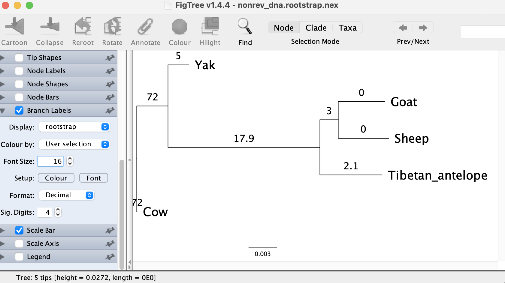
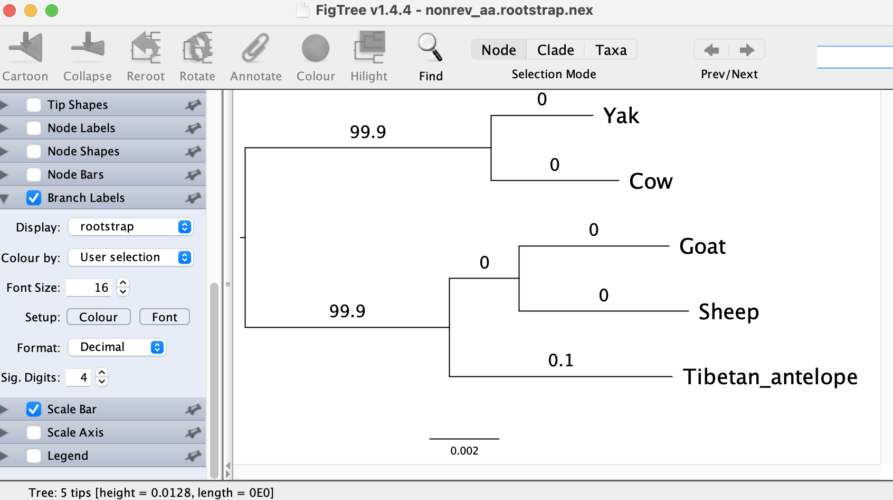

Rooting phylogenetic trees
==========================

Using time-reversible Markov models is a very common practice in phylogenetic analysis, 
because they provide high computational efficiency. However, these models infer _unrooted_ trees 
hence lack the ability to infer the root placement of the estimated phylogeny. 
In order to compensate for the inability of these models to root the tree, many researchers 
use external information such as using outgroup taxa or additional assumptions such as 
molecular-clocks. 

This guide provides the outgroup approach and another rooting approach using _non-reversible_ models ([Naser-Khdour et al., 2021]), which will be useful when an outgroup is lacking. Please make sure 
that you use IQ-TREE __version 2.1.3__ or later for full features below and cite this manuscript:

> S. Naser-Khdour, B.Q. Minh, R. Lanfear (2021) Assessing Confidence in Root Placement on Phylogenies: An Empirical Study Using Non-Reversible Models. <https://doi.org/10.1101/2020.07.31.230144>

Inferring unrooted tree with outgroup
-------------------------------------

We first demonstrate the outgroup approach to root the Bovidae family of five sampled species
(Yak, Cow, Goat, Sheep and Tibetan antelope) using two outgroup species (Pig and Whale).
Please download:

* An [input DNA alignment file](data/bovidae_outgroup.phy) for these 7 species.
* An [input partition file](data/bovidae.nex) that defines 52 genes in this alignment. 
This is a subset of the mammal dataset ([Wu et al., 2018]).

> Choosing a "good" outgroup is an entire topic on its own. In generally, 
> the outgroup must contain taxa that do not belong to the ingroup but 
> are evolutionarily close enough to the ingroup taxa. 

To infer an unrooted tree, run:

	iqtree2 -s bovidae_outgroup.phy -p bovidae.nex -B 1000 -T AUTO --prefix rev_dna_outg
	
that will invoke the ultrafast bootstrap with 1000 replicates (`-B 1000`), detect the
optimal number of threads (`-T AUTO`) and write all output files with the prefix `rev_dna_outg`.

The input alignment contains protein-coding genes. We can ask IQ-TREE to translate
the alignment into protein sequences using the standard genetic code (`-st NT2AA`) and perform
an amino-acid analysis on the translated alignment with:

	iqtree2 -s bovidae_outgroup.phy -p bovidae.nex -B 1000 -T AUTO -st NT2AA --prefix rev_aa_outg
	
where setting the prefix to `rev_aa_outg` avoids file overwriting with the previous run.
The resulting tree may now look like (extracted from `rev_aa_outg.iqtree`):

	NOTE: Tree is UNROOTED although outgroup taxon 'Yak' is drawn at root
	Numbers in parentheses are  ultrafast bootstrap support (%)

	+--Yak
	|
	+--Cow
	|
	|          +--Goat
	|       +--| (100)
	|       |  +--Sheep
	|   +---| (100)
	|   |   +---Tibetan_antelope
	+---| (100)
	    |                      +-------------------------------Wild_pig
	    +----------------------| (100)
	                           +-------------------Minke_whale

You can open `rev_aa_outg.treefile` in a tree viewer software (e.g. FigTree) and re-root
the tree on the branch separating the outgroup (`Wild_pig` and `Minke_whale`)
from the remaining ingroup to obtain an outgroup-rooted tree.

Finally, if you want you can also perform a non-partition analysis by removing the option `-p`.

Inferring rooted trees without outgroup
---------------------------------------

We will now infer a rooted tree using non-reversible models. Please download:

* An [input DNA alignment file](data/bovidae.phy) for 5 ingroup species 
(Yak, Cow, Goat, Sheep and Tibetan antelope). This is a sub-alignment of the alignment above.
We can re-use the same partition file.

To speed up the analysis, we will perform two steps. The first step is the same
as the run above to infer an unrooted tree using reversible models:

	iqtree2 -s bovidae.phy -p bovidae.nex -B 1000 -T AUTO --prefix rev_dna

This run will also write the best partitioning scheme to `rev_dna.best_scheme.nex` file.
In the second step, we will re-use this best scheme but replace the substitution model 
with the most general non-reversible DNA model, 12.12 or UNREST 
(see [this doc](Substitution-Models#lie-markov-models)) to obtain a rooted tree:

    iqtree2 -s bovidae.phy -p rev_dna.best_scheme.nex --model-joint 12.12 -B 1000 -T AUTO --prefix nonrev_dna

The option `--model-joint 12.12` tells IQ-TREE use a linked substitution model 12.12 across
all partitions. This is to avoid potential over-parameterization as this is very 
parameter-rich model with 12 parameters.

The resulting tree extracted from .iqtree file might look like this:

	NOTE: Tree is ROOTED at virtual root '__root__'
	Numbers in parentheses are  ultrafast bootstrap support (%)

           +---Yak
	+------| (72)
	|      |                                       +----------Goat
	|      |                                   +---| (100)
	|      |                                   |   +----------Sheep
	|      +-----------------------------------| (95)
	|                                          +-------------Tibetan_antelope
	|
	+**Cow
	|
	+**__root__

(You can better visualize the .treefile in a tree viewer software).

This run will write an additional tree file `nonrev_dna.rootstrap.nex` with _rootstrap_
support values (see box below for definition) annotated on every branch of the tree. If you open this file in FigTree 
it may look like this (click on "Branch Labels" and choose `rootstrap` for "Display"
as shown in the figure):

It shows that the tree might be rooted in the branch leading to `Cow`
with a rootstrap support of 72%, which is rather low. The 2nd best
branch separating Cow and Yak from the rest has a rootstrap support of 17.9%. So with this dataset the DNA model cannot reliably tell where
the root position is, but at least provides some candidates.

> **Rootstrap**: To compute rootstrap supports, we conduct a bootstrap analysis
to obtain a number of rooted bootstrap trees using non-reversible models.
We define the rootstrap support for each branch in the maximum likelihood (ML) tree, as the proportion of 
rooted bootstrap trees that have the root on that branch. The rootstrap support values are computed for all 
the branches including external branches. The sum of the rootstrap support values along 
the tree are always smaller than or equal to one. A sum that is smaller than one can 
occur when one or more bootstrap replicates are rooted on a branch that does not occur 
in the ML tree.

We will now try the amino-acid model to see if that helps. We again use `-st NT2AA` 
option to conveniently perform this analysis:

	# step 1: infer unrooted tree with reversible models
	iqtree2 -s bovidae.phy -p bovidae.nex -B 1000 -T AUTO -st NT2AA --prefix rev_aa
	
	# step 2: infer rooted tree with linked non-reversible models
	iqtree2 -s bovidae.phy -p rev_aa.best_scheme.nex --model-joint NONREV -B 1000 -T AUTO -st NT2AA --prefix nonrev_aa
	
The option `--model-joint NONREV` tells IQ-TREE to use the most general amino-acid model
NONREV and to link the NONREV model parameters across all partitions: NONREV has
379 parameters and linking them across partitions will avoid over-parameterization.
The tree extracted from `nonrev_aa.iqtree` file now may look like:

	NOTE: Tree is ROOTED at virtual root '__root__'
	Numbers in parentheses are  ultrafast bootstrap support (%)
	
	                                 +------------Yak
	+--------------------------------| (100)
	|                                +----------------Cow
	|
	|                                   +-------------------Goat
	|                          +--------| (100)
	|                          |        +---------------------Sheep
	+--------------------------| (100)
	|                          +-----------------------------Tibetan_antelope
	|
	+**__root__

Interestingly, the amino-acid model suggests a different root position compared with the DNA model. But this position agrees with the outgroup rooting approach. And the tree `nonrev_aa.rootstrap.nex` with rootstrap supports look like:

That means, the branch separating Yak and Cow from the rest receives a very high
rootstrap support of 99.9%. Therefore, the amino-acid model seems to have a much higher
power to detect the root, compared with the DNA model.

Testing root positions
----------------------

The rootstrap introduced above is one way to measure our confidence in the root placement, but it is not a 
statistical test. Alternatively, we can apply the [tree topology tests](Advanced-Tutorial#tree-topology-tests) to compare the log-likelihoods of the trees being rooted
on every branch of the ML tree. IQ-TREE v2.1.3 provides a convenient option `--root-test`
that will re-root the tree on every branch and perform the test for you. So you can run:

	iqtree2 -s bovidae.phy -p rev_aa.best_scheme.nex --model-joint NONREV -st NT2AA --root-test -zb 1000 -au -te nonrev_aa.treefile --prefix nonrev_aa_test

`-zb 1000 -au` is to perform several tree topology tests including the approximately-unbiased (AU) test for the tree found above (`-te nonrev_aa.treefile`). This run will
write a file `nonrev_aa_test.roottest.csv` which might look like:

	# Test results for rooting positions on every branch
	# This file can be read in MS Excel or in R with command:
	#    dat=read.csv('nonrev_aa_test.roottest.csv',comment.char='#')
	# Columns are comma-separated with following meanings:
	#    ID:      Branch ID
	#    logL:    Log-likelihood of the tree rooted at this branch
	#    deltaL:  logL difference from the maximal logl
	#    bp-RELL: bootstrap proportion using RELL method (Kishino et al. 1990)
	#    p-KH:    p-value of one sided Kishino-Hasegawa test (1989)
	#    p-SH:    p-value of Shimodaira-Hasegawa test (2000)
	#    c-ELW:   Expected Likelihood Weight (Strimmer & Rambaut 2002)
	#    p-AU:    p-value of approximately unbiased (AU) test (Shimodaira, 2002)
	ID,logL,deltaL,bp-RELL,p-KH,p-SH,c-ELW,p-AU
	1,-90388.66044,0,0.983,0.96,1,0.9695602131,0.9975595105
	8,-90401.6833,13.02286164,0.005,0.04,0.19,0.01262108065,0.00558089101
	5,-90401.68371,13.0232665,0.01,0.04,0.19,0.01262245766,0.006374455939
	3,-90410.10499,21.44455589,0.002,0.016,0.104,0.002397842346,0.001014359781
	2,-90410.1084,21.44796542,0,0.016,0.104,0.002389013519,0.0008999725939
	6,-90413.04441,24.38397245,0,0.005,0.059,0.0002047272296,0.0004975092439
	7,-90413.04797,24.38753181,0,0.005,0.059,0.0002046654974,0.0005061888325

The branches are sorted by log-likelihoods in descending order. The last column (p-AU)
shows the p-values of the AU test. The branch ID 1 has an AU p-value of 0.9975595105,
whereas all other branches has p-values < 0.01. To associate branch ID you can return to the FigTree window for `nonrev_aa.rootstrap.nex` file and select "Display" to "id" in the "Branch Labels" tab. 

The conclusion from this analysis: we can reject all rooting positions on branches
other than branch ID 1, which agrees with the rootstrap measure.

TIP: These options `--root-test -zb 1000 -au` can be combined with the rootstrap run 
in the previous section to calculate the rootstrap support values and the rooting test p-values in one single analysis.

[Naser-Khdour et al., 2021]: https://doi.org/10.1101/2020.07.31.230144
[Wu et al., 2018]: https://doi.org/10.1016/j.dib.2018.04.094

