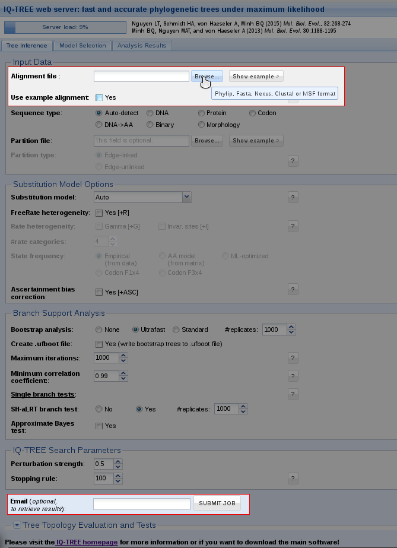
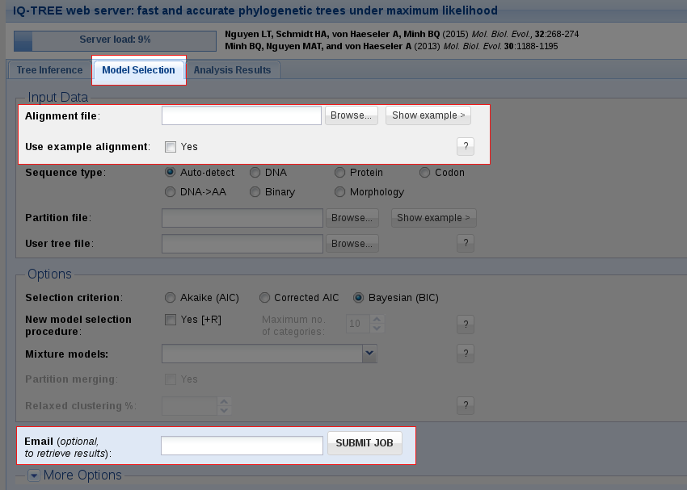

<!--jekyll 
docid: 05
icon: info-circle
doctype: tutorial
tags:
- tutorial
sections:
- name: Tree Inference
  url: tree-inference
- name: Model Selection
  url: model-selection
- name: Analysis Results
  url: analysis-results
jekyll-->
This tutorial gives users a quick starting guide for the IQ-TREE Web Server.
<!--more-->

<!-- START doctoc generated TOC please keep comment here to allow auto update -->
<!-- DON'T EDIT THIS SECTION, INSTEAD RE-RUN doctoc TO UPDATE -->
**Table of Contents**

- [Tree Inference](#tree-inference)
- [Model Selection](#model-selection)
- [Analysis Results](#analysis-results)

<!-- END doctoc generated TOC please keep comment here to allow auto update -->

This tutorial explains briefly how to use the IQ-TREE web server for fast online phylogenetic inference, accessible at [iqtree.cibiv.univie.ac.at](http://iqtree.cibiv.univie.ac.at){:target="_blank"}.

There are three tabs: [Tree Inference](#tree-inference), [Model Selection](#model-selection) and [Analysis Results](#analysis-results). 

------------

Tree Inference
------------

Tree Inference provides the most frequently used features of IQ-TREE and allows users to carry out phylogenetic analysis on a multiple sequence alignment (MSA). In the most basic case, no more than an MSA file is required to submit the job. Without further input, IQ-TREE will run with the default parameters and auto-detect the sequence type as well as the best-fitting substitution model. Additionally, Ultrafast Bootstrap ([Minh et al., 2013](http://mbe.oxfordjournals.org/content/30/5/1188){:target="_blank"}) and the SH-aLRT branch test ([Guindon et al., 2010](http://sysbio.oxfordjournals.org/content/59/3/307){:target="_blank"}) will be performed. 

You can either try out the web server with an example alignment by ticking the corresponding box or upload your own alignment file. By clicking on 'Browse' a dialog will open where you can select your MSA; the file formats Phylip, Fasta, Nexus, Clustal and MSF are supported. 

After that you can submit the job. If you provide an email address, a notification will be sent to you once the job is finished. In case you don't specify an email address, you will receive a link in the next step; you can bookmark this link to retrieve your results after the job is finished. 

------------

Model Selection
------------

IQ-TREE supports a wide range of substitution models for DNA, protein, codon, binary and morphological alignments. In case you do not know which model is appropriate for your data, IQ-TREE can automatically determine the best-fit model for your alignment. Use the Model Selection tab if you only want to find the best-fit model without doing tree reconstruction.

Like with [Tree Inference](#tree-inference), the only obligatory input is a multiple sequence alignment. You can either upload your own **alignment file** or use the **example alignment** to try out the web server and then **submit the job**. 

------------

Analysis Results
------------

In the tab Analysis Results you can monitor your jobs. With our example file, a run will only take a few seconds, depending on the server load. For your own alignments the CPU time limit is 24 hours. If you provided an email address when submitting the job, you will get an email once it is finished. 

Once a job is finished, you can select it by checking the corresponding box and then **download the selected jobs** as a zip file. This zip file will contain the results of your run, including the **Run Log** and the **Full Result** which are also accessible in the webserver. 

|Suffix| Explanation |
|------|-------------------|
|**.iqtree** | Full result of the run, this is the main report file  |
|**.log** | Run log |
| **.treefile** | Maximum likelihood tree in NEWICK format, can be visualized with treeviewer programs |
| .svg |  Graphical tree representation, done with ete view |
| .contree | Consensus tree with assigned branch supports where branch lengths are optimized on the original alignment; printed if Ultrafast Bootstrap is selected |