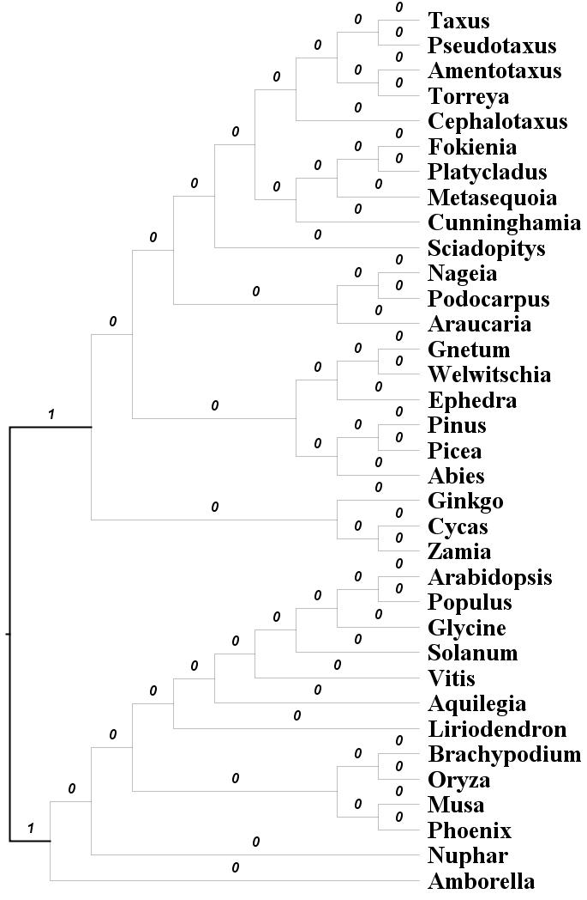

Estimating non-reversible substitution amino acid models
==========================

This tutorial provides a rooting approach using non-reversible models (cite nQMaker paper), which will be useful when an outgroup is lacking. Please make sure that you use the latest version of IQ-TREE for full features.

Estimating non-reversible models from a bunch of separate MSAs
-------------------------------------

We first demonstrate the estimation of a non-reversible model for Pfam dataset ([El-Gebali et al., 2018]). Please first download the file Pfam_datasets.zip from https://doi.org/10.6084/m9.figshare.14516712. This is a subset of the Pfam dataset, which contained 6654 separate MSAs for training and 6654 separate MSAs for test. The estimation (training) then can be accomplished with two commands in IQ-TREE 2. The first command is:

	iqtree2 -seed 1 -T 36 -S train_pfam -mset LG,WAG,JTT -cmax 4
	
where `-seed 1` option set the random seed, `-T 36` option let IQ-TREE utilize up to 36 CPU threads, `-T AUTO` will automatically detect the best number of threads, `-S train_pfam` option specifies the directory of training data; `-mset LG,WAG,JTT` option defines the initial candidate matrices to reduce computational burden; `-cmax 4` option restricts up to four categories for the rate heterogeneity across sites. This will run ModelFinder to find the best model for each MSA in the folder `train_pfam`. The best models and the best trees will be saved to `train_pfam.best_model.nex` and to `train_pfam.treefile`, respectively.  These two files will be used as the input for the second command that estimate a join non-reversible matrix:

	iqtree2 -seed 1 -T 36 -S train_pfam.best_model.nex -te train_pfam.treefile --model-joint NONREV+FO --init-model LG -pre pfam6654.NONREV
	
where`--init-model LG` option specifies the initial matrix; `-pre pfam6654.NONREV` option specifies the names of output files. We can obtain the resulting matrix (`NQ.pfam`) which is included in file `pfam6654.NONREV.iqtree` with the command:

	grep -A 21 "can be used as input for IQ-TREE" pfam6654.NONREV.iqtree | tail -n20 > NQ.pfam

You can open `NQ.pfam` in a text viewer, it is a 20x20 matrix. This file can then be used with IQ-TREE (e.g. `-m NQ.pfam`).

Estimating non-reversible models from one concatenated MSA (clade-specific dataset)
---------------------------------------

We will now estimate a non-reversible model for a clade-specific dataset. Please download the file 05_clades.zip from https://doi.org/10.6084/m9.figshare.14516712. There are five datasets in the zip: plant, mammal, insect, bird, yeast. We will demonstrate using plant, the smallest dataset. In each dataset folder, you will see three files named: 

* `alignment.nex` contains the alignment in NEXUS format.
* `train.nex` contains the training partitions  in NEXUS format.
* `test.nex` contains the test partitions in NEXUS format in NEXUS format.

We used `-p` option instead of `-S` option to estimate an edge-linked partition model with a single tree topology shared across all loci. This -p option is typically used with concatenation tree estimation that assumes a single species tree but rescale the branch lengths of the locus trees. It was shown to perform best among other partition models ([Duchêne et al., 2019]). The three commands are:

	# step 1: infer an single edge-linked tree with reversible models as initial models
	iqtree2 --seed 1 -T AUTO -s plant/alignment.nex -p plant/train.nex -m MFP -mset LG,WAG,JTT -cmax 4 --prefix plant/train
	
	# step 2: estimate a join non-reversible matrix across all loci
	iqtree2 -seed 1 -T AUTO -s plant/alignment.nex -p plant/train.best_model.nex -te plant/train.treefile --model-joint NONREV+FO --prefix plant/NONREV+FO
	
	# step 3: extract the resulting non-reversible matrix
	grep -A 21 "can be used as input for IQ-TREE" plant/NONREV+FO.iqtree | tail -n20 > NQ.plant

Testing root positions
----------------------

### Rootstrap support values test
One way to measure our confidence in the root placement is the *rootstrap support values* ([Naser-Khdour et al., 2021]). To compute the rootstrap support values, we conduct an ultra-fast bootstrap analysis (UFBoot2) to obtain a number (1000) of rooted bootstrap trees using non-reversible models. We define the rootstrap support for each branch in the maximum likelihood (ML) tree, as the proportion of rooted bootstrap trees that have the root on that branch. The rootstrap support values are computed for all the branches including external branches. The sum of the rootstrap support values along the tree are always smaller than or equal to one. A sum that is smaller than one can occur when one or more bootstrap replicates are rooted on a branch that does not occur in the ML tree. The command is:

	iqtree2 -s alignment.noog.nex -p all.best_scheme.nex --model-joint NONREV+FO -B 1000 -T AUTO --prefix nonrev_aa

The option `--model-joint NONREV+FO` of IQ-TREE specifies a sharing non-reversible amino-acid model NONREV+FO across all partitions, a sharing model across all partitions will help reducing over-parameterization (non-reversible amino-acid model has 379 parameters). The tree `nonrev_aa.rootstrap` with rootstrap supports will look like:

The two bold branches have rootstrap support values of 1, and this root position matches up with the published tree where the position of root was chosen by using outgroups ([Ran et al., 2018]).

### Statistical tree topology test
Another way for testing the confidence of root positions is using [statistical tree topology test](Advanced-Tutorial#tree-topology-tests). The latest IQ-TREE program has the option `--root-test` that will re-root the tree on every branch and calculate the log-likelihoods of the corresponding ML tree. You can use the command below

	iqtree2 -seed 1 -T AUTO -s alignment.noog.nex -p aa_nonrev_test.best_model.nex --root-test -zb 1000 -au -te aa_nonrev_test.treefile --prefix aa_nonrev_test_roottest

where `-zb 1000 -au` is the option to perform several tree topology tests including the approximately-unbiased (AU) test for the tree found above (`-te aa_nonrev_test.treefile`). This run will write a file `aa_nonrev_test_roottest.csv` which look like:

	# Test results for rooting positions on every branch
	# This file can be read in MS Excel or in R with command:
	#    dat=read.csv('nonrev_aa_test.roottest.csv',comment.char='#')
	# Columns are comma-separated with following meanings:
	#    ID:      Branch ID
	#    logL:    Log-likelihood of the tree rooted at this branch
	#    deltaL:  logL difference from the maximal logl
	#    bp-RELL: bootstrap proportion using RELL method (Kishino et al. 1990)
	#    p-KH:    p-value of one sided Kishino-Hasegawa test (1989)
	#    p-SH:    p-value of Shimodaira-Hasegawa test (2000)
	#    c-ELW:   Expected Likelihood Weight (Strimmer & Rambaut 2002)
	#    p-AU:    p-value of approximately unbiased (AU) test (Shimodaira, 2002)
	ID,logL,deltaL,bp-RELL,p-KH,p-SH,c-ELW,p-AU
	1,-8541943.701,0,1,1,1,0.9999903322,0.9955706228
	39,-8541973.434,29.73381524,0,0,0.819,8.057356197e-06,0.003808085043
	2,-8541974.941,31.2405361,0,0,0.809,1.610243266e-06,0.0003448761961
	40,-8541998.985,55.28464775,0,0,0.436,1.641863211e-10,0.000401794297
	43,-8542003.822,60.12090595,0,0,0.372,3.415645107e-14,2.914631952e-17
	14,-8542046.011,102.3104284,0,0,0.059,3.885010135e-26,2.106667003e-60
	3,-8542046.011,102.3103866,0,0,0.059,3.855702954e-26,2.57001835e-52
	42,-8542101.573,157.8727419,0,0,0.003,4.47274549e-43,3.205357886e-05
	41,-8542102.298,158.5969634,0,0,0.004,9.631156232e-44,3.146509983e-05

The branches are sorted by log-likelihoods in descending order. The last column (p-AU) shows the p-values of the AU test. The branch ID 1 has an AU p-value of 0.9955706228, whereas all other branches has p-values < 0.01. The conclusion from this analysis: we can reject all rooting positions on branches other than branch ID 1, which agrees with the rootstrap measure.

NOTE: You can combine options `--root-test -zb 1000 -au` with the rootstrap run in the previous section to calculate the both rootstrap support values and the rooting test p-values in one single analysis.

[Naser-Khdour et al., 2021]: https://doi.org/10.1093/sysbio/syab067
[El-Gebali et al., 2018]: https://doi.org/10.1093/nar/gky995
[Duchêne et al., 2019]: https://doi.org/10.1093/molbev/msz291
[Ran et al., 2018]: https://doi.org/10.1098/rspb.2018.1012
